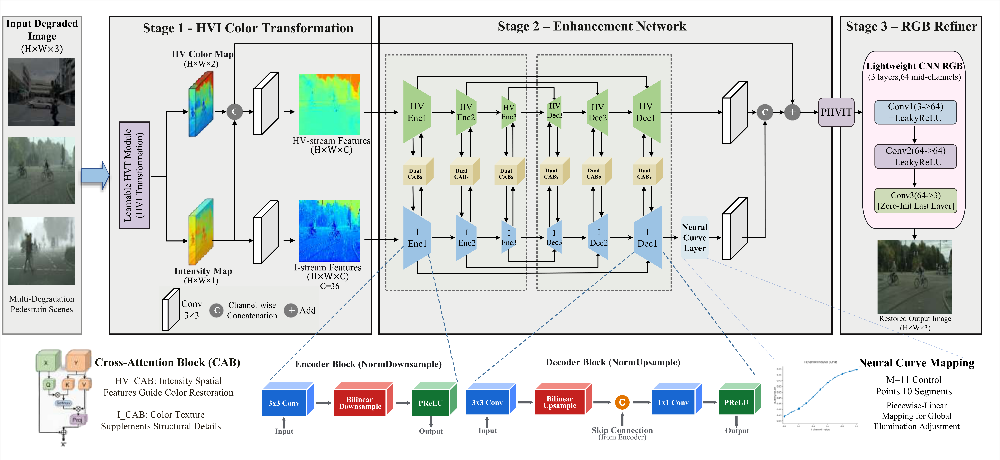

# DualSpaceCIDNet

[](https://www.python.org/)
[](https://pytorch.org/)
[](https://opensource.org/licenses/MIT)

Official PyTorch implementation of the paper:  
**"Cascaded Dual-Space Color-Illumination Decoupling Network with Neural Curve Adjustment for All-Weather Image Restoration"**

---

## 📌 Method Overview



DualSpaceCIDNet proposes a cascaded color-illumination decoupling framework tailored for challenging adverse-weather and composite degradation conditions (including low light, dense haze, heavy rain, snow, and mixed nighttime corruptions). 

### Key Highlights:
1. **Continuous Polarized HVI Decoupling**: Mathematically maps coupled non-linear sRGB into continuous Cartesian chromaticity $(H, V)$ and illumination intensity $(I)$, eliminating color-space singularities and dark-plane noise inherent in cylindrical color representations.
2. **Adaptive Neural Curve Adjustment**: Introduces an 11-control-point piecewise-linear curve module on the intensity branch to perform dynamic illumination mapping.
3. **Output-Domain Residual Refiner**: Implements an end-to-end zero-initialized residual refiner operating directly in the output RGB domain to learn high-fidelity spatial details.

---

## 🛠️ Environment Setup

Clone this repository and set up the Python environment:

```bash
git clone https://github.com/Dlam1113/DualSpaceCIDNet.git
cd DualSpaceCIDNet
pip install -r requirements.txt
```

---

## 🚀 Quick Start (Inference Demo)

We provide a lightweight standalone inference script `demo.py` to evaluate degraded images:

```bash
# Run sanity-check inference on sample image
python demo.py --input demo_images/input.png --output demo_images/output.png
```

To evaluate with a trained checkpoint:
```bash
python demo.py --input demo_images/input.png --output demo_images/output.png --weights weights/best_model.pt
```

---

## 📊 Benchmark Results

Evaluated on the **Combined Adverse-Weather Benchmark** (200 images comprising 100 rainy and 100 foggy scenes) reported in the manuscript:

### Quantitative Comparisons on Adverse-Weather Datasets

| Method | Category | Combined (PSNR ↑ / SSIM ↑ / LPIPS ↓) | Rainy Subset (PSNR ↑ / SSIM ↑) | Foggy Subset (PSNR ↑ / SSIM ↑) |
| :--- | :---: | :---: | :---: | :---: |
| NAFNet (2022) | All-in-One | 19.94 / 0.9025 / 0.1301 | 21.19 / 0.9205 | 18.68 / 0.8845 |
| Histoformer (2024) | All-in-One | 23.79 / 0.9308 / 0.1025 | 25.67 / 0.9488 | 21.92 / 0.9128 |
| PromptIR (2023) | All-in-One | 23.87 / 0.9175 / 0.1047 | 26.06 / 0.9375 | 21.68 / 0.8974 |
| Restormer (2022) | All-in-One | 24.16 / 0.9196 / 0.1033 | 26.63 / 0.9422 | 21.69 / 0.8971 |
| MoCE-IR (2025) | All-in-One | 25.14 / 0.9407 / 0.0855 | 26.83 / 0.9561 | 23.45 / 0.9253 |
| Baseline CIDNet (2025) | Baseline | 25.43 / 0.9582 / 0.0550 | 26.47 / 0.9656 | 24.39 / 0.9508 |
| AirNet (2022) | All-in-One | 26.43 / 0.9532 / 0.0648 | 28.10 / 0.9607 | 25.63 / 0.9336 |
| **DualSpaceCIDNet (Ours)** | **Proposed** | **26.71 / 0.9609 / 0.0544** | **27.78 / 0.9685** | **25.64 / 0.9533** |

*DualSpaceCIDNet achieves state-of-the-art overall restoration fidelity on the combined adverse-weather dataset, delivering the highest overall PSNR (26.71 dB), superior structural similarity (0.9609 SSIM), and the lowest perceptual error (0.0544 LPIPS).*

---

## 📦 Training Code and Checkpoint Release Notice

- **Pretrained Weights**: The full trained checkpoints for all benchmarks will be released on cloud storage immediately upon formal acceptance of the manuscript.
- **Training Pipeline & Datasets**: The complete multi-weather dataset pipelines, manifest generators, and multi-GPU distributed training scripts are currently being packaged and will be fully open-sourced upon paper publication.

---

## 📄 License

This project is licensed under the MIT License - see the [LICENSE](LICENSE) file for details.

